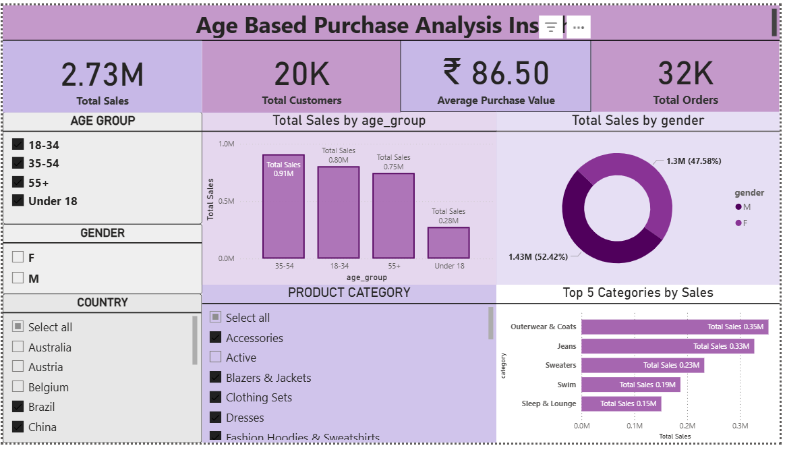

# Age_based_purchase_analysis_project

# 🧾 Age-Based Purchase Analysis Dashboard

## 📊 Project Overview
This Power BI dashboard provides insights into customer purchase behavior across different **age groups**, **genders**, and **product categories**.  
It was built using a real-world e-commerce dataset and aims to identify key trends that drive sales and engagement.

---

## 🧠 Key Features
- **Interactive Slicers** for Age Group, Gender, Country, and Product Category
- **KPIs:** Total Sales, Total Customers, Average Purchase Value, and Total Orders
- **Visuals:**
  - Clustered Column Chart – Total Sales by Age Group
  - Donut Chart – Sales Share by Gender
  - Bar Chart – Top 5 Product Categories by Sales
- Built using **Power BI**, **SQL**, and **Python/Pandas (optional)**

---

## 🛠️ Tools & Technologies
- Power BI Desktop
- SQL Server (for data cleaning and transformation)
- Microsoft Excel / CSV Data
- GitHub for project version control

---

## 📁 Files Included
| File | Description |
|------|--------------|
| `Age_Based_Purchase_Analysis.pbix` | Main Power BI Dashboard |
| `E-COMMERCE.csv` | Source dataset |
| `age_based_analysis.sql` | SQL scripts used for preprocessing |
| `Dashboard_Screenshot.png` | Image preview of the final dashboard |
| `Dashboard_Report.pdf` | Exported report version |

---

## 📷 Dashboard Preview

---

## 👩‍💻 Author
**HARINI HARIHARAN**  
📧 harinihariharan0107@gmail.com
🌐 [LinkedIn Profile](https://www.linkedin.com/in/harini-hariharan-78020a248/)

---

## 📜 License
This project is open-source and available under the [MIT License](LICENSE).
